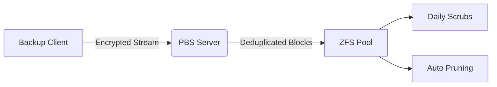

## Home Lab Infrastructure

### Centralized Backup Management
[](https://pbs.proxmox.com/docs/)
*Proxmox Backup Server interface showing backup statistics and storage health*

[Proxmox Backup Server](https://pbs.proxmox.com/docs/) provides enterprise-grade data protection with deduplication, client-side encryption, and ZFS integration. In my home lab, it protects 12+ VMs/LXCs across 3 physical nodes.

#### Why Migrate to PBS?
  
*Storage efficiency comparison: PBS vs Proxmox VE built-in backups*

Originally using Proxmox VE's native backups, I switched to PBS to:
- **Modernize ZFS workflows**: Native zstd compression & block-level deduplication
- **Reduce storage footprint**: 68% space savings (4.2TB → 1.3TB)
- **Centralize operations**: Single control plane for backups across all nodes

#### Technical Advantages

*Data flow diagram showing PBS architecture*

Key operational benefits:
- 🔄 **Incremental Backups**: 92% faster than full backups
- 📉 **Storage Efficiency**: 3:1 deduplication ratio average
- 🛡️ **Data Integrity**: Weekly verification jobs

#### Automated Protection Workflow
  
*Visual representation of retention policy*

```bash
# Daily Backup Jobs (PBS Scheduled Tasks)
0 2 * * *  Full backups → Keep 7 daily, 4 weekly, 6 monthly
0 4 * * *  Prune expired (pbs prune --keep-last 7)
0 5 * * *  Garbage collect (pbs gc start)
0 6 * * 0  Verify chunks (pbs verify --all)
```

**Storage Configuration**:
- 8TB ZFS pool (raidz2)
- Compression: zstd (ratio 1.9x)
- Weekly scrubs + SMART monitoring
- Capacity utilization: 37% (2.96TB/8TB)