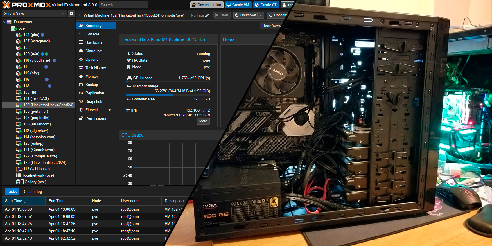
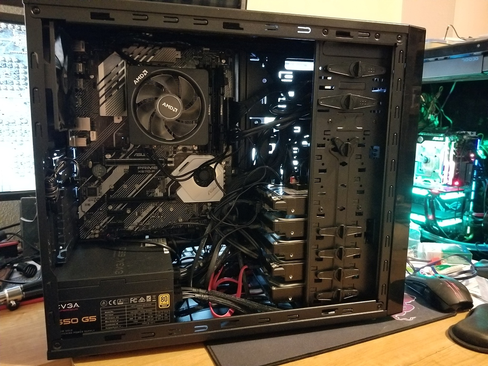
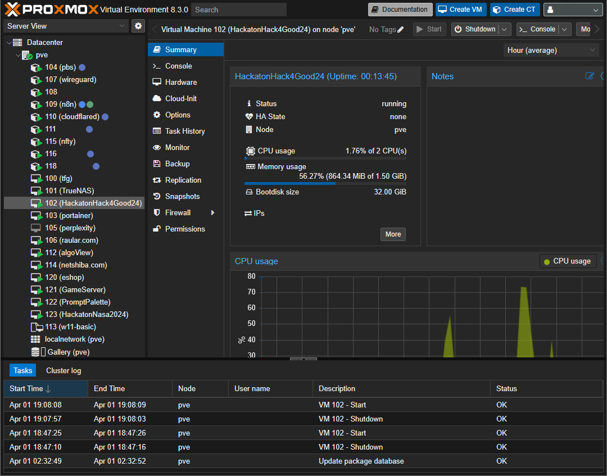
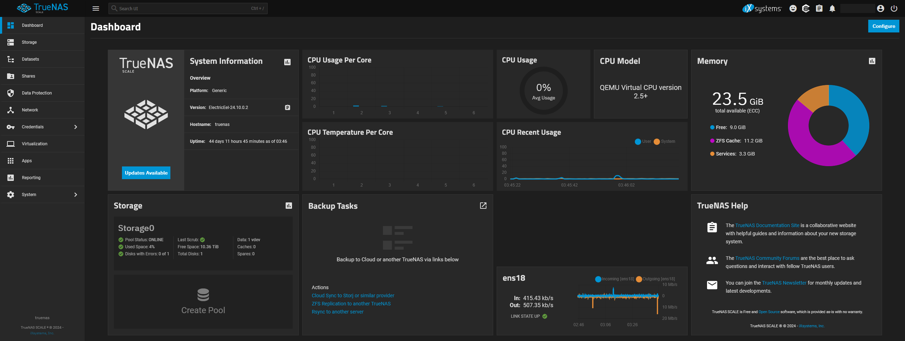
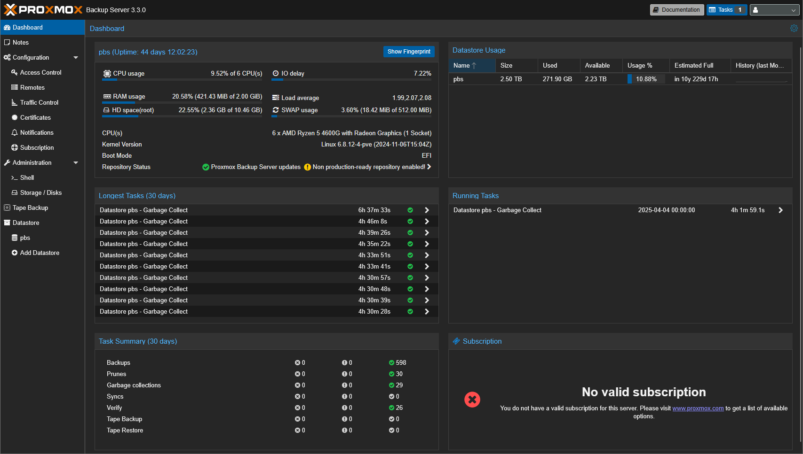
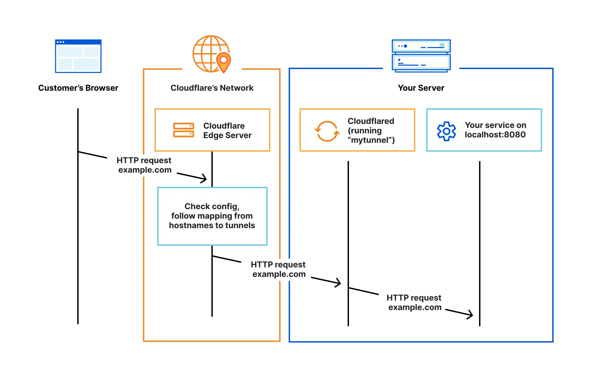
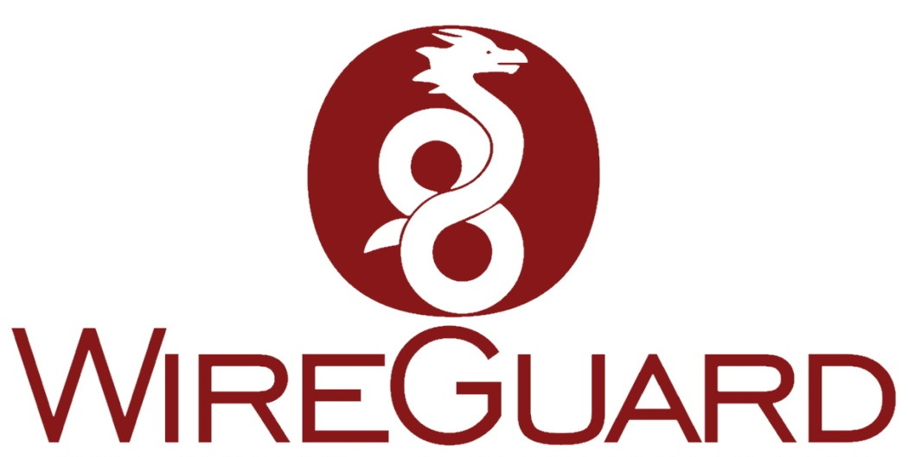
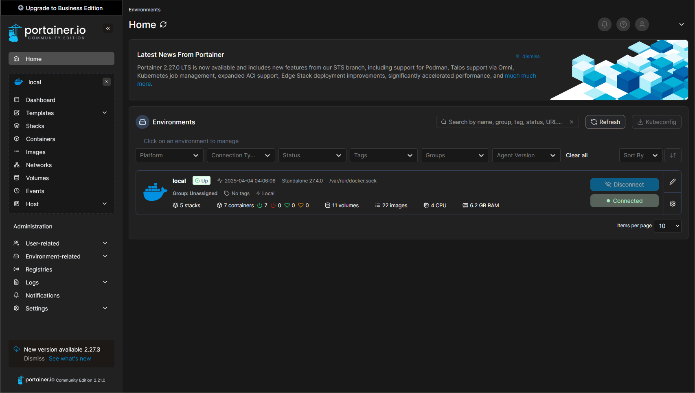
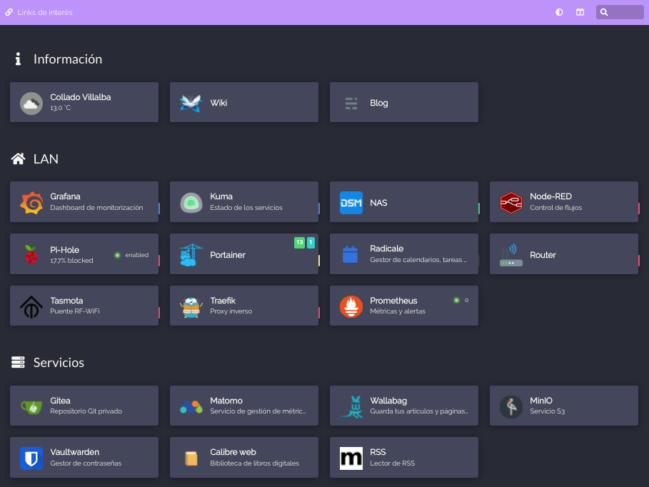

## Introduction

Welcome to the documentation for my Home Server project. While it comprises various interconnected technologies and services, I consider it a single, continuously evolving project. Its primary purpose is twofold:

1.  **Replicate a Professional Environment:** To mirror the infrastructure I work with professionally, allowing me to test, develop, and deploy web applications (primarily Laravel-based) in a realistic setting.
2.  **Personal Utility & Learning:** To self-host various applications and services for personal use, explore new technologies, and deepen my understanding of system administration, networking, and virtualization.

This page provides a comprehensive overview of the hardware, software, and architecture powering my home lab.

## Motivation: Why Build a Home Server?

Building and maintaining a home server offers several advantages:

*   **Hands-On Learning:** Direct experience with enterprise-grade tools like Proxmox, ZFS, Docker, and VPNs.
*   **Development & Testing Sandbox:** A dedicated, isolated environment for experimenting with code, configurations, and deployments without impacting production systems.
*   **Self-Hosting:** Gaining control over personal data and services (e.g., notes, photos, recipes) instead of relying solely on cloud providers.
*   **Cost-Effectiveness:** Leveraging existing hardware or cost-effective components for powerful computing resources.
*   **Skill Enhancement:** Bridging the gap between software development and system administration/DevOps practices.

## Hardware Specifications

The core of the home lab is a custom-built server designed for a balance of performance, efficiency, and storage capacity.

*   **Processor:** AMD Ryzen 5 4600G (6 Cores / 12 Threads) - Chosen for its good multi-core performance and integrated graphics, reducing the need for a dedicated GPU.
*   **Memory:** 64GB DDR4 RAM (3200MHz) - Ample memory allows for running multiple virtual machines and containers simultaneously without performance bottlenecks.
*   **Storage Configuration:**
    *   **OS Drive:** 500GB NVMe SSD - Hosts the Proxmox VE operating system for fast boot times and responsiveness.
    *   **VM Operations Drive:** 1TB NVMe SSD - Dedicated high-speed storage for virtual machine disks and demanding container volumes, ensuring quick application performance.
    *   **Bulk Storage Array:** 12TB Refurbished HDD (7200 RPM) - Configured in a ZFS array managed by TrueNAS Scale, providing large-capacity storage for backups, media, and less performance-critical data. Using refurbished enterprise drives offers a cost-effective way to achieve high capacity.

## System Architecture Overview

The server operates on a tiered architecture, leveraging virtualization and containerization for efficient resource management and isolation.

<!--  -->

*   **Hypervisor:** Proxmox VE serves as the bare-metal hypervisor, managing all virtualized resources.
*   **Storage Backend:** TrueNAS Scale runs as a VM (or could be bare-metal, but currently virtualized) and manages the ZFS storage pool, providing resilient storage and network shares.
*   **Virtual Machines (VMs):** Used primarily for hosting full operating systems like Ubuntu Server (for development environments) or Windows when necessary. Each major web project typically resides in its own dedicated VM.
*   **LXC Containers:** Leveraged for lightweight Linux services that don't require a full OS kernel, offering lower overhead than VMs.
*   **Docker Containers:** Managed via Portainer CE, used for deploying applications distributed as Docker images, providing easy setup and management.
*   **Networking:** A combination of Nginx Proxy Manager, Cloudflare Tunnels, and WireGuard VPN handles internal routing, secure public exposure, and remote access.

## Core Software Components & Services

### 1. Proxmox VE (Virtual Environment)

Proxmox VE is the foundation of the server. It's an open-source virtualization management platform that combines KVM (for VMs) and LXC (for containers) under a unified web-based interface.

*   **Usage:** Manages all VMs and LXC containers, resource allocation (CPU, RAM, storage), networking, and clustering capabilities (though currently running as a single node).
*   **Benefits:** Powerful web UI, robust feature set, active community support, integrates well with ZFS and Ceph.

### 2. TrueNAS Scale

TrueNAS Scale is responsible for managing the bulk storage array. It's an open-source storage OS based on Linux, with first-class ZFS support.

*   **Key Features Used:**
    *   **ZFS Management:** Provides robust data integrity, pooling, snapshots, and replication capabilities for the 12TB HDD array. I migrated from OpenMediaVault specifically for TrueNAS Scale's native ZFS integration and features.
    *   **Automated Snapshots:** Regular, automated snapshots protect against data loss and ransomware.
    *   **Network Shares:** Provides storage access to VMs and other devices on the network via NFS (for Linux VMs/containers) and SMB/CIFS (for Windows access or general file sharing).

### 3. Proxmox Backup Server (PBS)

To ensure data safety beyond ZFS snapshots, I run Proxmox Backup Server (often as a VM or LXC container allocated a dedicated portion of the TrueNAS storage).

*   **Function:** Provides centralized, deduplicated, incremental backups of VMs and containers running on Proxmox VE.
*   **Benefits:** Space-efficient backups, centralized management, automated backup jobs, verification checks, garbage collection, and pruning policies keep backup storage manageable. Daily backups are configured for critical machines.

### 4. Networking Infrastructure

Managing network access securely and efficiently is critical.

*   **Cloudflare Tunnel:**
    *   **Purpose:** Securely exposes web services hosted on the home server to the internet *without* opening any ports on the router/firewall. It creates a persistent outbound connection to Cloudflare's edge.
    *   **Benefits:** Hides the server's origin IP, provides Cloudflare's DDoS protection and WAF capabilities, simplifies SSL certificate management (via Cloudflare's Universal SSL). Integrated with Cloudflare Zero Trust policies for finer-grained access control.

    

*   **Nginx Proxy Manager (NPM):**
    *   **Purpose:** Runs internally as a Docker container to manage access to various services within the local network. It acts as a reverse proxy.
    *   **Usage:** Assigns local domain names (e.g., `truenas.local`, `portainer.local`) to internal IP addresses/ports, handles SSL termination using Let's Encrypt certificates (for internal HTTPS), and provides basic access control. Essential for accessing services that shouldn't be publicly exposed.

    

*   **WireGuard VPN:**
    *   **Purpose:** Provides secure remote access to the entire home network when I'm away from home.
    *   **Usage:** Allows me to connect my laptop or phone as if it were on the local network, enabling access to internal services (like NPM-managed ones or SSH) without exposing them publicly. Also useful for granting temporary, secure access to others for specific events or collaboration.

    

### 5. Portainer CE (Community Edition)

Portainer provides a user-friendly GUI for managing Docker environments.

*   **Usage:** Manages all Docker containers running on the system (often within a dedicated VM or directly on Proxmox host if configured). Simplifies deploying applications using Docker Compose (Stacks), viewing container logs, managing volumes and networks, and monitoring container resource usage.
*   **Benefits:** Centralized management point for containerized applications, easier than managing purely via CLI for many tasks.

### 6. Application Hosting

*   **Web Development VMs:**
    *   **Strategy:** Each significant web project (like internal tools or client project staging environments) gets its own Ubuntu Server VM.
    *   **Rationale:** Provides complete isolation for dependencies (PHP versions, libraries, databases), resource limits, and configurations. Mirrors a typical cloud deployment strategy. Includes isolated Laravel setups, databases (MySQL/PostgreSQL), cron jobs, queue workers, and specific scripts.

*   **Other Self-Hosted Applications:**
    *   Beyond development, the server hosts various utilities, typically as Docker containers managed by Portainer:
        *   **Obsidian Sync:** Using CouchDB as a backend for self-hosted synchronization of Obsidian notes across devices.
        *   **This Portfolio Website:** The Docusaurus site itself is often built and served locally before deployment.
        *   **Immich Photos:** A self-hosted Google Photos alternative for photo and video backup and management.
        *   **Mealie Recipes:** A recipe manager and meal planner.
        *   *...and various other tools and experiments.*

    

## Conclusion

My home server is a vital part of my personal and professional development workflow. It provides a powerful, flexible, and secure environment for learning, testing, and hosting applications. By combining robust hardware with versatile software like Proxmox, TrueNAS, Docker, and smart networking solutions, I've built an infrastructure that meets my needs for both development replication and personal self-hosting. This setup continues to evolve as I explore new technologies and refine existing processes.