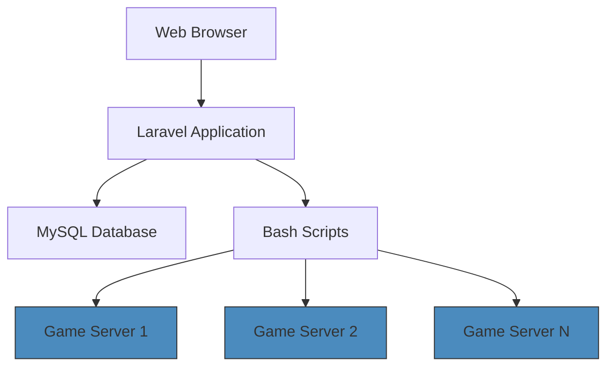

[](https://github.com/netraular/gameserver) 
[](https://github.com/netraular/gameserver) 
[](https://laravel.com) 
[](https://docker.com) 
[](https://mysql.com) 
[](https://getbootstrap.com)

[](http://gameserver.netshiba.com/)

---

## 📌 Overview

A centralized web solution for managing multiple game servers on a single virtual machine. This interface provides secure access to critical server operations through an intuitive dashboard, eliminating the need for direct command-line interactions.


---

## 🌟 Key Features

| **Category**        | **Details**                                                                 |
|----------------------|-----------------------------------------------------------------------------|
| **Security**         | Role-based access control with Laravel authentication                       |
| **Server Control**   | Start/stop servers, save game states, and monitor status in real-time       |
| **VM Integration**   | Direct interaction with virtual machine services through Bash script hooks  |
| **Dashboard**        | Responsive Bootstrap interface with operational history tracking            |

---

## 🛠 Technical Highlights

- **Framework**: Laravel 10 (PHP) with Eloquent ORM
- **Core Functionality**:  
  - Bash script integration for service management  
  - Containerized game servers using Docker
  - CRON jobs for automated maintenance tasks
- **Data Management**: MySQL database with migration scripts
- **Security**: CSRF protection, encrypted sessions, and password hashing
- **CI/CD**: GitHub Actions for automated testing and deployment

---

## 🌐 Live Demo

Explore the live management interface:  
[http://gameserver.netshiba.com/](http://gameserver.netshiba.com/)

---

## ⚙️ System Architecture



---

## 📂 Repository Structure

```bash
├── app/               # Laravel core logic
├── config/            # Service configurations
├── docker/            # Container definitions
├── scripts/           # Bash scripts for server control
├── database/          # Migrations and seeders
└── resources/         # Blade templates & frontend assets
```