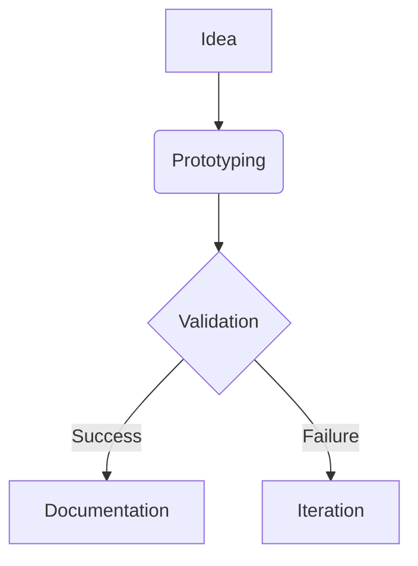

# 🚀 My Technical Projects 

Welcome to my dynamic portfolio of technical experiments and implementations! This living documentation showcases my hands-on journey across multiple technology domains.

## 🔍 What You'll Discover Here

This section features detailed case studies of my personal initiatives and team collaborations, focusing on:

 **Web Development**  
Full-stack applications and experimental interfaces using modern frameworks

 **Embedded Systems**  
Practical implementations with ESP32 microcontrollers and sensor networks

 **Home Lab Management**  
Proxmox virtualization environment with self-hosted services and container orchestration

## 🌟 Key Focus Areas

### Cross-Domain Experimentation
My projects reflect diverse technical interests:
- Rapid prototyping methodologies
- Open-source tool implementations
- Hybrid hardware/software solutions
- Cloud-native local deployments

### Hackathon Excellence
  
Proud winner of the [CityTech Challenge 2023](https://example.com/hackathon-project) where we developed an IoT environmental monitoring system in 48 hours! Regular participant in coding marathons and timed challenges.

## 📚 Documentation Philosophy

All projects follow this iterative documentation approach, capturing both successful implementations and valuable learning experiences from challenges.

## 🛠️ Technical Playground
  
My Proxmox-based home server (24/7 operation) hosts:
- Containerized microservices
- Development environments
- Network monitoring tools
- Personal cloud storage

## 🤝 Collaboration Ready
I welcome technical discussions and project ideas! Reach me via:
- [Email](mailto:contact@example.com)
- [GitHub Discussions](https://github.com/yourprofile)
- [LinkedIn](https://linkedin.com/in/yourprofile)

**Browse the sidebar → to explore specific project deep-dives!**